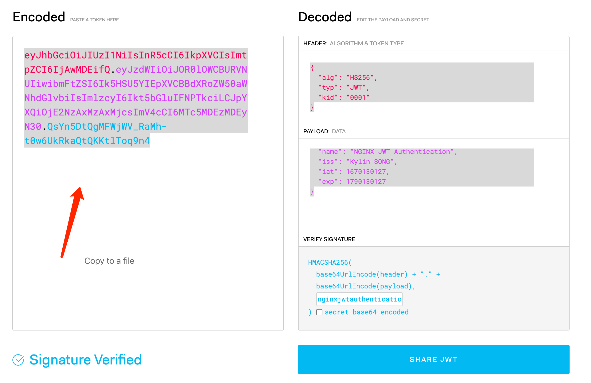
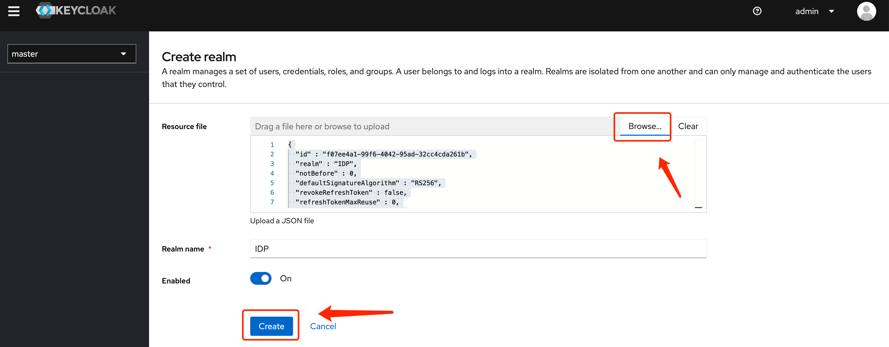
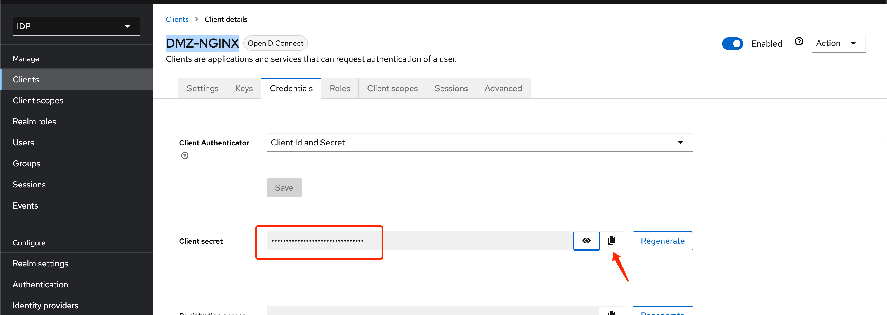

= Nginx DevOps Demo
:toc: manual

== Build & Run

[source, bash]
.*Build*
----
docker build -t cloudadc/nginx-devops-demo:2.0.4 -f Dockerfile.alpine .
docker push cloudadc/nginx-devops-demo:2.0.4
----

[source, bash]
.*Run alpine*
----
docker run -it --rm --name nginx -p 8001-8020:8001-8020 -p 8443:8443 cloudadc/nginx-devops-demo:2.0.4
----

== AB Test

[source, bash]
.*1. Access A*
----
$ curl http://localhost:8002/foo -I
HTTP/1.1 200 OK
Server: nginx/1.21.6
Date: Tue, 22 Nov 2022 10:30:54 GMT
Content-Type: text/html
Content-Length: 8
Connection: keep-alive
----

[source, bash]
.*2. Set to B*
----
curl -X POST "http://localhost:8001/api/7/http/keyvals/canary" -H "accept: application/json" -H "Content-Type: application/json" -d "{ \"abswitch\": \"1\"}"
----

[source, bash]
.*3. Access B*
----
$ curl http://localhost:8002/foo -I
HTTP/1.1 404 Not Found
Server: nginx/1.21.6
Date: Tue, 22 Nov 2022 10:32:35 GMT
Content-Type: text/html
Content-Length: 7
Connection: keep-alive
----

[source, bash]
.*4. Set to A*
----
curl -X PATCH "http://localhost:8001/api/7/http/keyvals/canary" -H "accept: application/json" -H "Content-Type: application/json" -d "{ \"abswitch\": \"0\"}"
----

[source, bash]
.*5. Access A*
----
$ curl http://localhost:8002/foo -I
HTTP/1.1 200 OK
Server: nginx/1.21.6
Date: Tue, 22 Nov 2022 10:33:58 GMT
Content-Type: text/html
Content-Length: 8
Connection: keep-alive
----

== SSL

[source, bash]
.*Test SSL*
----
$ curl --cacert conf/dev/crt/example.com.crt --resolve example.com:8443:127.0.0.1 https://example.com:8443/test -v
* Added example.com:8443:127.0.0.1 to DNS cache
* Hostname example.com was found in DNS cache
*   Trying 127.0.0.1...
* TCP_NODELAY set
* Connected to example.com (127.0.0.1) port 8443 (#0)
* ALPN, offering h2
* ALPN, offering http/1.1
* successfully set certificate verify locations:
*   CAfile: conf/dev/crt/example.com.crt
  CApath: none
* TLSv1.2 (OUT), TLS handshake, Client hello (1):
* TLSv1.2 (IN), TLS handshake, Server hello (2):
* TLSv1.2 (IN), TLS handshake, Certificate (11):
* TLSv1.2 (IN), TLS handshake, Server key exchange (12):
* TLSv1.2 (IN), TLS handshake, Server finished (14):
* TLSv1.2 (OUT), TLS handshake, Client key exchange (16):
* TLSv1.2 (OUT), TLS change cipher, Change cipher spec (1):
* TLSv1.2 (OUT), TLS handshake, Finished (20):
* TLSv1.2 (IN), TLS change cipher, Change cipher spec (1):
* TLSv1.2 (IN), TLS handshake, Finished (20):
* SSL connection using TLSv1.2 / ECDHE-RSA-AES256-GCM-SHA384
* ALPN, server accepted to use http/1.1
* Server certificate:
*  subject: CN=example.com; emailAddress=ksong@example.com; O=Kylin Soong Ltd; L=Beijing; C=CN
*  start date: Nov 24 15:56:42 2022 GMT
*  expire date: Nov 21 15:56:42 2032 GMT
*  common name: example.com (matched)
*  issuer: CN=example.com; emailAddress=ksong@example.com; O=Kylin Soong Ltd; L=Beijing; C=CN
*  SSL certificate verify ok.
> GET /test HTTP/1.1
> Host: example.com:8443
> User-Agent: curl/7.64.1
> Accept: */*
> 
< HTTP/1.1 200 OK
< Server: nginx/1.21.6
< Date: Thu, 24 Nov 2022 16:20:54 GMT
< Content-Type: text/html
< Content-Length: 8
< Connection: keep-alive
< 
success
* Connection #0 to host example.com left intact
* Closing connection 0
----

== JWT

=== JWK on File System

[source, bash]
.*1. Generate JWK*
----
$ ./auth/jwkgen.sh nginxjwtauthentication
generate nginx.jwk, content:
{"keys": [{ "k":"bmdpbnhqd3RhdXRoZW50aWNhdGlvbg", "kty":"oct", "kid":"0001" }] }
----

NOTE: `nginxjwtauthentication` used to sign JWT, `nginx.jwk` use to nginx auth jwt module setting up. 

*2. Generate JWT*

Use https://jwt.io/ to generate JWT, set the following 

[cols="2,5a"]
|===
|ITEMS |CONFIG

|HEADER
|

[source, json]
----
{
  "alg": "HS256",
  "typ": "JWT",
  "kid": "0001"
}
----

|PAYLOAD
|

[source, json]
----
{
  "sub": "NGINX TEST",
  "name": "NGINX JWT Authentication",
  "iss": "Kylin SONG",
  "iat": 1670130127,
  "exp": 1790130127
}
----

|SIGNATURE
|Replace `your-256-bit-secret` with `nginxjwtauthentication` which used in generate JWK, keep the other as default.

|===

[source, bash]
.*3. Test*
----
$ curl -H "Authorization: Bearer `cat auth/nginx.jwt`" http://127.0.0.1:8003/test 
success
----

NOTE: If the above test hit 401, invalid token, place use the Step 2 to re geneate a token.

=== NGINX + Keycloak
 
[source, bash]
.*1. Start Keycloak*
----
docker run -p 8080:8080 -e KEYCLOAK_ADMIN=admin -e KEYCLOAK_ADMIN_PASSWORD=admin quay.io/keycloak/keycloak:20.0.1 start-dev
docker run -p 8080:8080 --name keycloak -e KEYCLOAK_ADMIN=admin -e KEYCLOAK_ADMIN_PASSWORD=admin quay.io/keycloak/keycloak:20.0.1 start-dev
----

*2. Create Realm via import from file*

* Login into Keycloak http://10.1.10.1:8080/admin/
* Import `idp.json` as below

[source, bash]
.*3. Overview key API*
----
$ for i in authorization_endpoint jwks_uri token_endpoint ; do curl -s http://10.1.10.1:8080/realms/IDP/.well-known/openid-configuration | jq .$i ; done
"http://10.1.10.1:8080/realms/IDP/protocol/openid-connect/auth"
"http://10.1.10.1:8080/realms/IDP/protocol/openid-connect/certs"
"http://10.1.10.1:8080/realms/IDP/protocol/openid-connect/token"
----

*4. Extract Client Secret*

[source, bash]
.*5. Create Configuration*
----
git clone https://github.com/nginxinc/nginx-openid-connect
cd nginx-openid-connect
/configure.sh -k request -s yOXgfxc4QMBGhFtjP8tdr7ldzSKmA8lp -h nginx.test.com http://10.1.10.1:8080/realms/IDP/.well-known/openid-configuration
----

NOTE: `yOXgfxc4QMBGhFtjP8tdr7ldzSKmA8lp` is the client secrets, this will genrate 4 files: `frontend.conf`, `openid_connect_configuration.conf`, `openid_connect.server_conf`, `openid_connect.js` which can be used as a start configuration pages.

[source, bash]
.*6. Overview the openid_connect_configuration.conf*
----
map $host $oidc_authz_endpoint {
    nginx.test.com http://10.1.10.1:8080/realms/IDP/protocol/openid-connect/auth;
    default "http://127.0.0.1:8080/auth/realms/master/protocol/openid-connect/auth";
    #www.example.com "https://my-idp/oauth2/v1/authorize";
}

map $host $oidc_token_endpoint {
    nginx.test.com http://10.1.10.1:8080/realms/IDP/protocol/openid-connect/token;
    default "http://127.0.0.1:8080/auth/realms/master/protocol/openid-connect/token";
}

map $host $oidc_jwt_keyfile {
    nginx.test.com http://10.1.10.1:8080/realms/IDP/protocol/openid-connect/certs;
    default "http://127.0.0.1:8080/auth/realms/master/protocol/openid-connect/certs";
}

map $host $oidc_client {
    nginx.test.com "DMZ-NGINX";
    default "my-client-id";
}

map $host $oidc_client_secret {
    nginx.test.com "yOXgfxc4QMBGhFtjP8tdr7ldzSKmA8lp";
    default "my-client-secret";
}

map $host $oidc_hmac_key {
    nginx.test.com YIs2PYadE+E9smawpjCrN55H;
    # This should be unique for every NGINX instance/cluster
    default "ChangeMe";
}
----

[source, bash]
.*7. Start Docker*
----
docker run -it --rm --name nginx -p 8001-8020:8001-8020 -p 8443:8443 cloudadc/nginx-devops-demo:2.0.4
----

*8. Access http://nginx.test.com:8010/ to test*

[source, bash]
.**
----

----

[source, bash]
.**
----

----
