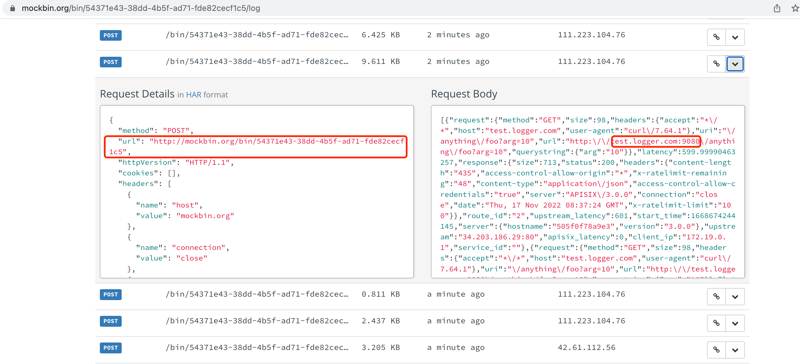
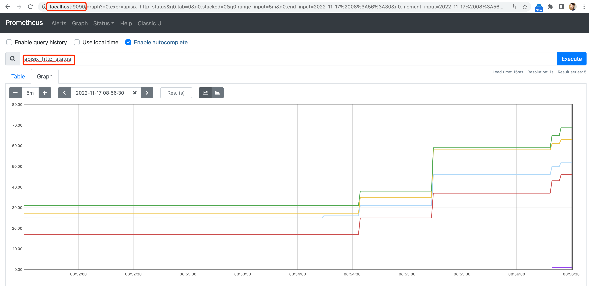
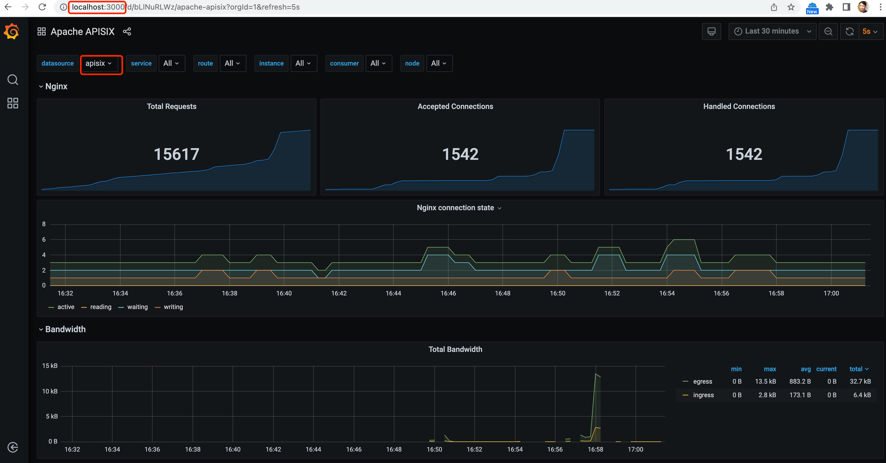

= API Gateway
:toc: manual

== APISIX

=== Install 

[source, bash]
.*Install via Docker*
----
git clone https://github.com/apache/apisix-docker.git
cd apisix-docker/example

$ docker-compose -p docker-apisix up -d
Starting docker-apisix_web2_1             ... done
Starting docker-apisix_etcd_1             ... done
Starting docker-apisix_web1_1             ... done
Starting docker-apisix_apisix-dashboard_1 ... done
Starting docker-apisix_grafana_1          ... done
Starting docker-apisix_prometheus_1       ... done
Starting docker-apisix_apisix_1           ... done

docker run -d -p 9411:9411 openzipkin/zipkin
----

[source, bash]
.*Review the forwarded port*
----
$ docker ps
CONTAINER ID   IMAGE                                 COMMAND                  CREATED       STATUS              PORTS                                                                                                      NAMES
505f0f78a9e3   apache/apisix:3.0.0-debian            "/docker-entrypoint.…"   7 hours ago   Up About a minute   0.0.0.0:9080->9080/tcp, 0.0.0.0:9091-9092->9091-9092/tcp, 0.0.0.0:9180->9180/tcp, 0.0.0.0:9443->9443/tcp   docker-apisix_apisix_1
a63ab0371486   grafana/grafana:7.3.7                 "/run.sh"                7 hours ago   Up About a minute   0.0.0.0:3000->3000/tcp                                                                                     docker-apisix_grafana_1
5a55bc3db0d3   nginx:1.19.0-alpine                   "/docker-entrypoint.…"   7 hours ago   Up About a minute   0.0.0.0:9081->80/tcp                                                                                       docker-apisix_web1_1
92593051ed37   prom/prometheus:v2.25.0               "/bin/prometheus --c…"   7 hours ago   Up About a minute   0.0.0.0:9090->9090/tcp                                                                                     docker-apisix_prometheus_1
2614d1ecab09   nginx:1.19.0-alpine                   "/docker-entrypoint.…"   7 hours ago   Up About a minute   0.0.0.0:9082->80/tcp                                                                                       docker-apisix_web2_1
89eedf60d85c   apache/apisix-dashboard:2.13-alpine   "/usr/local/apisix-d…"   7 hours ago   Up About a minute   0.0.0.0:9000->9000/tcp                                                                                     docker-apisix_apisix-dashboard_1
121cd74f273d   bitnami/etcd:3.4.15                   "/opt/bitnami/script…"   7 hours ago   Up About a minute   0.0.0.0:2379->2379/tcp, 2380/tcp                                                                           docker-apisix_etcd_1
----

|===
|PORT | NOTE

|2379 
| etcd

|9000 
|dashboard

|9081
|Web 1

|9082
|Web 2

|3000
|grafana

|9090
|prometheus

|9180
|Admin API

|9080
|

|9091-9092
|

|9443
|

|===

[source, bash]
.*Check the services/routes/updateam
----
$ for i in services routes upstreams ; do curl "http://127.0.0.1:9180/apisix/admin/$i/" -H 'X-API-KEY: edd1c9f034335f136f87ad84b625c8f1' ; done
{"list":[],"total":0}
{"list":[],"total":0}
{"list":[],"total":0}
----

*Login into dashboard*

Login into dashboard via `http://localhost:9000/`, use `admin` as username, `admin` as password.

=== Expose API

[source, bash]
.*1. Create upstream*
----
curl "http://127.0.0.1:9180/apisix/admin/upstreams/1" -H "X-API-KEY: edd1c9f034335f136f87ad84b625c8f1" -X PUT -d '
{
  "type": "roundrobin",
  "nodes": {
    "httpbin.org:80": 1
  }
}'
----

The following API can be used to query/delete upstream:

* Query: curl -s "http://127.0.0.1:9180/apisix/admin/upstreams/1" -H "X-API-KEY: edd1c9f034335f136f87ad84b625c8f1"
* Delete: curl "http://127.0.0.1:9180/apisix/admin/upstreams/1" -H "X-API-KEY: edd1c9f034335f136f87ad84b625c8f1" -X DELETE

[source, bash]
.*2. Create Route*
----
curl "http://127.0.0.1:9180/apisix/admin/routes/1" -H "X-API-KEY: edd1c9f034335f136f87ad84b625c8f1" -X PUT -d '
{
  "methods": ["GET"],
  "host": "example.com",
  "uri": "/anything/*",
  "upstream_id": "1"
}'
----

The following API can be used to query/delete routes:

* Query: curl "http://127.0.0.1:9180/apisix/admin/routes/1" -H "X-API-KEY: edd1c9f034335f136f87ad84b625c8f1"
* Delete: curl "http://127.0.0.1:9180/apisix/admin/routes/1" -H "X-API-KEY: edd1c9f034335f136f87ad84b625c8f1" -X DELETE

[source, bash]
.*3. Test*
----
curl -i -X GET "http://127.0.0.1:9080/anything/foo?arg=10" -H "Host: example.com"
----

=== Protect API

[source, bash]
.*1. Create Route with rate limit*
----
curl -i http://127.0.0.1:9180/apisix/admin/routes/2 -H 'X-API-KEY: edd1c9f034335f136f87ad84b625c8f1' -X PUT -d '
{
    "uri": "/anything/*",
    "plugins": {
        "limit-count": {
            "count": 2,
            "time_window": 60,
            "rejected_code": 503,
            "key_type": "var",
            "key": "remote_addr"
        }
    },
  "upstream_id": "1"
}'
----

[source, bash]
.*2. Test*
----
$ for i in {1..3} ; do curl -I -X GET "http://127.0.0.1:9080/anything/foo?arg=10" ; done
HTTP/1.1 200 OK
Content-Type: application/json
Content-Length: 417
Connection: keep-alive
X-RateLimit-Limit: 2
X-RateLimit-Remaining: 1
Date: Thu, 17 Nov 2022 08:17:53 GMT
Access-Control-Allow-Origin: *
Access-Control-Allow-Credentials: true
Server: APISIX/3.0.0

HTTP/1.1 200 OK
Content-Type: application/json
Content-Length: 417
Connection: keep-alive
X-RateLimit-Limit: 2
X-RateLimit-Remaining: 0
Date: Thu, 17 Nov 2022 08:17:55 GMT
Access-Control-Allow-Origin: *
Access-Control-Allow-Credentials: true
Server: APISIX/3.0.0

HTTP/1.1 503 Service Temporarily Unavailable
Date: Thu, 17 Nov 2022 08:17:55 GMT
Content-Type: text/html; charset=utf-8
Content-Length: 269
Connection: keep-alive
Server: APISIX/3.0.0
----

NOTE: Due to exceed the max limit count of 2 request in 1 minutes, the 3rd request get 503.

=== Observe API

==== Log

[source, bash]
.*1. Create Route*
----
curl http://127.0.0.1:9180/apisix/admin/routes/2 -H 'X-API-KEY: edd1c9f034335f136f87ad84b625c8f1' -X PUT -d '
{
  "plugins": {
    "http-logger": {
      "uri": "http://mockbin.org/bin/54371e43-38dd-4b5f-ad71-fde82cecf1c5"
    },
    "limit-count": {
      "count": 100,
      "time_window": 60,
      "rejected_code": 503,
      "key_type": "var",
      "key": "remote_addr"
    }
  },
  "upstream_id": "1",
  "uri": "/anything/*"
}'
----

[source, bash]
.*2. Make some test*
----
for i in {1..100} ; do curl -I -X GET "http://127.0.0.1:9080/anything/foo?arg=10" -H "Host: test.logger.com" ; done
----

*3. Check from http logger*

==== Prometheus

[source, bash]
.*1. Create Route*
----
curl http://127.0.0.1:9180/apisix/admin/routes/2 -H 'X-API-KEY: edd1c9f034335f136f87ad84b625c8f1' -X PUT -d '
{
  "plugins": {
    "prometheus": {},
    "http-logger": {
      "uri": "http://mockbin.org/bin/54371e43-38dd-4b5f-ad71-fde82cecf1c5"
    },
    "limit-count": {
      "count": 100,
      "time_window": 60,
      "rejected_code": 503,
      "key_type": "var",
      "key": "remote_addr"
    }
  },
  "upstream_id": "1",
  "uri": "/anything/*"
}'
----

[source, bash]
.*2. Make some test*
----
for i in {1..100} ; do curl -I -X GET "http://127.0.0.1:9080/anything/foo?arg=10"  ; done
----

*3. Check the Prometheus*

==== Grafana

[source, bash]
.*1. Make some test*
----
for i in {1..100} ; do curl -I -X GET "http://127.0.0.1:9080/anything/foo?arg=10"  ; done
----

*2. Review Grafana Dashboard*

==== Zipkin

[source, bash]
.*1. Create Route*
----
curl http://127.0.0.1:9180/apisix/admin/routes/2 -H 'X-API-KEY: edd1c9f034335f136f87ad84b625c8f1' -X PUT -d '
{
  "plugins": {
    "zipkin": {
      "endpoint": "http://127.0.0.1:9411/api/v2/spans",
      "sample_ratio": 1
    },
    "prometheus": {},
    "http-logger": {
      "uri": "http://mockbin.org/bin/54371e43-38dd-4b5f-ad71-fde82cecf1c5"
    },
    "limit-count": { 
      "count": 100,
      "time_window": 60,
      "rejected_code": 503,
      "key_type": "var",
      "key": "remote_addr"
    }
  },
  "upstream_id": "1",
  "uri": "/anything/*"
}'
----

[source, bash]
.*2. Make one test*
----
$ curl -s  http://127.0.0.1:9080/anything/foo?arg=10 | jq
{
  "args": {
    "arg": "10"
  },
  "data": "",
  "files": {},
  "form": {},
  "headers": {
    "Accept": "*/*",
    "Host": "127.0.0.1",
    "User-Agent": "curl/7.64.1",
    "X-Amzn-Trace-Id": "Root=1-6375fb9e-160ed73c536682a8569a564b",
    "X-B3-Parentspanid": "57f5548509edb515",
    "X-B3-Sampled": "1",
    "X-B3-Spanid": "4eb94314ed6669e1",
    "X-B3-Traceid": "da48ba8d025ce51281056f7d958cfae4",
    "X-Forwarded-Host": "127.0.0.1"
  },
  "json": null,
  "method": "GET",
  "origin": "172.19.0.1, 111.223.104.76",
  "url": "http://127.0.0.1/anything/foo?arg=10"
}
----

NOTE: `X-B3-Parentspanid`, `X-B3-Sampled`, `X-B3-Spanid`, `X-B3-Traceid` be appened to HTTP Headers.

*3 Check with the Zipkin*

Login into http://127.0.0.1:9411/zipkin/ for tracing via either `X-B3-Traceid`, or others.

=== Cache API responses

[source, bash]
.*1. Create Route*
----
curl http://127.0.0.1:9180/apisix/admin/routes/2 -H 'X-API-KEY: edd1c9f034335f136f87ad84b625c8f1' -X PUT -d '
{ 
  "plugins": {
    "proxy-cache": {
      "cache_key": [
        "$uri",
        "-cache-id"
      ],
      "cache_bypass": [
        "$arg_bypass"
      ],
      "cache_method": [
        "GET"
      ],
      "cache_http_status": [
        200
      ],
      "hide_cache_headers": true,
      "no_cache": [
        "$arg_test"
      ]
    },
    "zipkin": {
      "endpoint": "http://127.0.0.1:9411/api/v2/spans",
      "sample_ratio": 1
    },
    "prometheus": {},
    "http-logger": {
      "uri": "http://mockbin.org/bin/54371e43-38dd-4b5f-ad71-fde82cecf1c5"
    },
    "limit-count": {
      "count": 100,
      "time_window": 60,
      "rejected_code": 503,
      "key_type": "var",
      "key": "remote_addr"
    }
  },
  "upstream_id": "1",
  "uri": "/anything/*"
}'
----

[source, bash]
.*2. Test Response Cache*
----
$ for i in {1..3} ; do sleep 0.5 ; curl -I -X GET "http://127.0.0.1:9080/anything/foo?arg=10"  ; done
HTTP/1.1 200 OK
Content-Type: application/json
Content-Length: 588
Connection: keep-alive
X-RateLimit-Limit: 100
X-RateLimit-Remaining: 99
Date: Thu, 17 Nov 2022 10:24:58 GMT
Access-Control-Allow-Origin: *
Access-Control-Allow-Credentials: true
Server: APISIX/3.0.0
Apisix-Cache-Status: MISS

HTTP/1.1 200 OK
Content-Type: application/json
Content-Length: 588
Connection: keep-alive
X-RateLimit-Limit: 100
X-RateLimit-Remaining: 98
Date: Thu, 17 Nov 2022 10:24:58 GMT
Access-Control-Allow-Origin: *
Access-Control-Allow-Credentials: true
Server: APISIX/3.0.0
Apisix-Cache-Status: HIT

HTTP/1.1 200 OK
Content-Type: application/json
Content-Length: 588
Connection: keep-alive
X-RateLimit-Limit: 100
X-RateLimit-Remaining: 97
Date: Thu, 17 Nov 2022 10:24:58 GMT
Access-Control-Allow-Origin: *
Access-Control-Allow-Credentials: true
Server: APISIX/3.0.0
Apisix-Cache-Status: HIT
----

NOTE: Refer to Response Header `Apisix-Cache-Status`, the 1st response is `MISS`, the 2nd and 3rd response is `HIT`.

[source, bash]
.*TODO*
----
TODO
----
