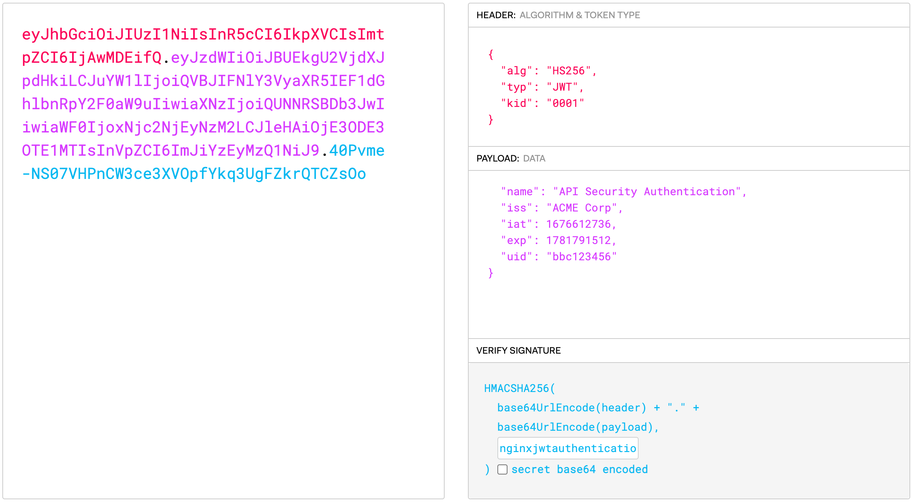
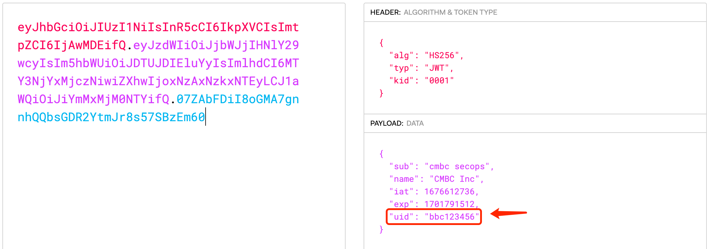

= Protect Application with NGINX(On-premise)
:toc: manual

== 安装与部署

=== 把机准备

[source, bash]
.*功能测试把机*
----
docker run -itd --rm --name app-http -p 8080:8080 cloudadc/cafe:1.0
----

NOTE: Use the `ip addr add 10.1.10.172/24 dev ens33` to add multiple IP addresses to single Linux network interface.

=== 安装

[source, bash]
.*1. Install NGINX*
----
yum localinstall nginx-plus-28-1.el7.ngx.x86_64.rpm
----

[source, bash]
.*2. Install Dependencies(perl-thrift, jq)*
----
yum install epel-release -y
yum install perl-thrift -y
yum install jq -y
----

[source, bash]
.*3. Install NGINX app protect*
----
yum install `ls`
----

The rpm lists as below:

[source, bash]
----
app-protect-28+4.100.1-1.el7.ngx.x86_64.rpm
app-protect-attack-signatures-2023.01.19-1.el7.ngx.x86_64.rpm
app-protect-common-10.208.1-1.el7.ngx.x86_64.rpm
app-protect-compiler-10.208.1-1.el7.ngx.x86_64.rpm
app-protect-engine-10.208.1-1.el7.ngx.x86_64.rpm
app-protect-plugin-4.100.1-1.el7.ngx.x86_64.rpm
app-protect-threat-campaigns-2023.01.24-1.el7.ngx.x86_64.rpm
nginx-plus-module-appprotect-28+4.100.1-1.el7.ngx.x86_64.rpm
----

[source, bash]
.*4. vetify the installed rpms*
----
# rpm -qa | grep app-protect
app-protect-28+4.100.1-1.el7.ngx.x86_64
app-protect-common-10.208.1-1.el7.ngx.el7.centos.x86_64
app-protect-engine-10.208.1-1.el7.ngx.el7.centos.x86_64
app-protect-threat-campaigns-2023.01.24-1.el7.ngx.x86_64
app-protect-attack-signatures-2023.01.19-1.el7.ngx.x86_64
app-protect-compiler-10.208.1-1.el7.ngx.x86_64
app-protect-plugin-4.100.1-1.el7.ngx.x86_64

# rpm -qa | grep nginx
nginx-plus-28-1.el7.ngx.x86_64
nginx-plus-module-appprotect-28+4.100.1-1.el7.ngx.x86_64
----

=== 配置

[source, bash]
.*1. nginx.conf 中添加动态模块*
----
load_module modules/ngx_http_app_protect_module.so;
----

[source, bash]
.*2. 在 http/server/location 上下文开启应用防护*
----
app_protect_enable on;
----

[source, bash]
.*3. 在 http/server/location 上下文开启日志（输出到文件）*
----
app_protect_security_log_enable on;
app_protect_security_log "/etc/app_protect/conf/log_default.json" /var/log/app_protect/security.log;
----

[source, bash]
.*4. 启动*
----
systemctl start nginx
----

=== 测试

[source, bash]
.*1. 在 location 上下文开启应用防护*
----
    location /foo {
        status_zone status_app_foo;
        app_protect_enable on;
        proxy_pass http://backend;
    }

    location /bar {
        status_zone status_app_bar;
        proxy_pass http://backend;
    }
----

[source, bash]
.*2. 访问 foo*
----
$ curl "http://10.1.10.195:8101/foo?a="<script>"&b=1234"

<html><head><title>Request Rejected</title></head><body>The requested URL was rejected. Please consult with your administrator.  Your support ID is: 1386739387023060088  <a href='javascript:history.back();'>[Go Back]</a></body></html>
----

[source, bash]
.*3. 访问 bar*
----
$ curl "http://10.1.10.195:8101/bar?a=<script>&b=1234"
 F5 Demo App

    Request URI: /bar?a=<script>&b=1234
    Protocol: HTTP/1.0

    Server IP: 10.1.10.181
    Server Port: 8080
    Server Hostname: 10.1.10.181

    Client IP: 10.1.10.195
    Client Port: 36154
    Client Hostname: 10.1.10.195

    Session: 872FD68450D1948D778F0604A11DA9FC

    X-Forwarded-For: null

    Cookies:  

    Request Headers: host: [backend] connection: [close] user-agent: [curl/7.64.1] accept: [*/*] 
----

== 通用型防护能力

=== SQL Injection

[source, bash]
----
$ curl http://10.1.10.195:8101/foo?hfsagrs=-1+union+select+user%2Cpassword+from+users+--+
<html><head><title>Request Rejected</title></head><body>The requested URL was rejected. Please consult with your administrator.  Your support ID is: 1386739387023062128  <a href='javascript:history.back();'>[Go Back]</a></body></html>
----

=== Cross Site Scripting

[source, bash]
----
$ curl http://10.1.10.195:8101/foo?a="<script>"
<html><head><title>Request Rejected</title></head><body>The requested URL was rejected. Please consult with your administrator.  Your support ID is: 1386739387023062638  <a href='javascript:history.back();'>[Go Back]</a></body></html
----

=== 目录遍历防护效果

[source, bash]
----
$ curl http://10.1.10.195:8101/foo?../../../test
<html><head><title>Request Rejected</title></head><body>The requested URL was rejected. Please consult with your administrator.  Your support ID is: 458779997830158493  <a href='javascript:history.back();'>[Go Back]</a></body></html>
----

== 自定义策略

=== 文件类型防护

[source, bash]
.*1. 创建 /etc/app_protect/conf/filetype.json 文件*
----
{
    "name": "external_resources_file_types",
    "template": {
        "name": "POLICY_TEMPLATE_NGINX_BASE"
    },
    "applicationLanguage": "utf-8",
    "enforcementMode": "blocking",
    "blocking-settings": {
        "violations": [
            {
                "name": "VIOL_FILETYPE",
                "alarm": true,
                "block": true
            }
        ]
    },
    "filetypes": [
    {
        "name": "*",
        "type": "wildcard",
        "allowed": true,
        "checkPostDataLength": false,
        "postDataLength": 4096,
        "checkRequestLength": false,
        "requestLength": 8192,
        "checkUrlLength": true,
        "urlLength": 2048,
        "checkQueryStringLength": true,
        "queryStringLength": 2048,
        "responseCheck": false
    },
    {
        "name": "pat",
        "allowed": false
    },
    {
        "name": "mat",
        "allowed": false
    },
    {
        "name": "txt",
        "allowed": false
    }
  ]
}
----

[source, bash]
.*2. 配置 NGINX*
----
    location /foo {
        status_zone status_app_foo;
        app_protect_enable on;
        app_protect_policy_file "/etc/app_protect/conf/filetype.json" ;
        proxy_pass http://backend;
    }
----

[source, bash]
.*3. 测试*
----
$ curl http://10.1.10.195:8101/foo?../../../test ; echo
<html><head><title>Request Rejected</title></head><body>The requested URL was rejected. Please consult with your administrator.  Your support ID is: 17432556761964223971  <a href='javascript:history.back();'>[Go Back]</a></body></html>
----

== 自定义特征库

=== Filter by Content

[source, bash]
.*Key Policy*
----
"rule": "content:\"test123\"; nocase;"
----

* link:filter-by-content/uds-filter-content.json[uds-filter-content.json]
* link:filter-by-content/uds-filter-content-policy.json[uds-filter-content-policy.json]
* link:filter-by-content/uds-filter-content.conf[uds-filter-content.conf]

[source, bash]
.*Test*
----
// normal request
$ curl http://10.1.10.195:8108/foo/test345
Server address: 172.17.0.2:8080
Server name: f25377244e7c
Date: 14/Mar/2023:03:12:41 +0000
URI: /foo/test345
Request ID: 46f465862262b61ab6903b8539a873b2

// risk request
$ curl http://10.1.10.195:8108/foo/test123
<html><head><title>Request Rejected</title></head><body>The requested URL was rejected. Please consult with your administrator.  Your support ID is: 7231362286722259098  <a href='javascript:history.back();'>[Go Back]</a></body></html>
----

=== Illegal Request Method

[source, bash]
.*Key Policy*
----
"rule": "re2:\"/^(CONNECT|DELETE|TRACE|COPYMOVE|PUT)\\s+/\"; nocase;",
----

* link:illegal-request-method/uds-illegal-request-method.json[uds-illegal-request-method.json]
* link:illegal-request-method/uds-illegal-request-method-policy.json[uds-illegal-request-method-policy.json]
* link:illegal-request-method/illegal-request-method.conf[illegal-request-method.conf]

[source, bash]
.*Test*
----
// normal request
$ curl http://10.1.10.195:8109/foo/test -X GET
Server address: 172.17.0.2:8080
Server name: f25377244e7c
Date: 14/Mar/2023:03:24:36 +0000
URI: /foo/test
Request ID: c71d7200e7ceb9baadc952880d3886f4

// risk request
$ curl http://10.1.10.195:8109/foo/test -X DELETE
<html><head><title>Request Rejected</title></head><body>The requested URL was rejected. Please consult with your administrator.  Your support ID is: 7231362286722261648  <a href='javascript:history.back();'>[Go Back]</a></body></html>
----

=== XFF Injection

[source, bash]
.*Key Policy*
----
"rule": "re2:\"/X-Forwarded-For:.*?\\s+(select|update|union|wait|sleep|insert|chr|char|substr|substring)/\"; nocase;",
----

* link:xff-injection/uds-xff-injection.json[uds-xff-injection.json]
* link:xff-injection/uds-xff-injection-policy.json[uds-xff-injection-policy.json]
* link:xff-injection/xff-injection.conf[xff-injection.conf]

[source, bash]
.*Test*
----
// normal request
$ curl http://10.1.10.195:8110/foo/test
Server address: 172.17.0.2:8080
Server name: f25377244e7c
Date: 14/Mar/2023:03:42:49 +0000
URI: /foo/test
Request ID: 5db73250b5aa912944c7976044c04179

// risk request
$ curl -H "X-Forwarded-For: select * from t where 1 =1 " http://10.1.10.195:8110/foo/test
<html><head><title>Request Rejected</title></head><body>The requested URL was rejected. Please consult with your administrator.  Your support ID is: 17170494753228555214  <a href='javascript:history.back();'>[Go Back]</a></body></html>
----

== API Security Authentication

=== Token Validation

[source, bash]
.*1. Generate JWK*
----
./jwkgen.sh nginxjwtauthenticationbykylin > api.security.jwk
----

NOTE: More details about JWK refer to https://datatracker.ietf.org/doc/html/rfc7517, JWK usually can be accessed from a Zero-trust gateway, or IDP server. In this section we configured JWK on local file system. the generated `api.security.jwk` will be copy to NGINX Host.

*2. Generate JWT*

NOTE: More details about JWT refer to https://datatracker.ietf.org/doc/html/rfc7519.

[source, bash]
.**
----

----

=== user id validation

*1. The JWT Token Payload defined a user id*

* link:auth/jwt.conf[jwt.conf]
* link:auth/jwt.js[jwt.js]
* link:auth/test.jwt[test.jwt]

[source, bash]
.*2. Test*
----
// normal request
$ curl -H "Authorization: Bearer `cat auth/test.jwt`" http://10.1.10.195:8107/foo/test?uid=bbc123456
Server address: 172.17.0.2:8080
Server name: f25377244e7c
Date: 14/Mar/2023:05:46:51 +0000
URI: /foo/test?uid=bbc123456
Request ID: 85573e3554db784466a5f4223a4835d6

// risk request
$ curl -H "Authorization: Bearer `cat auth/test.jwt`" http://10.1.10.195:8107/foo/test?uid=aab123456
uid not align with security token governance uid
----

[source, bash]
.**
----

----

[source, bash]
.**
----

----

[source, bash]
.**
----

----

[source, bash]
.**
----

----

[source, bash]
.**
----

----

[source, bash]
.**
----

----

[source, bash]
.**
----

----

[source, bash]
.**
----

----
