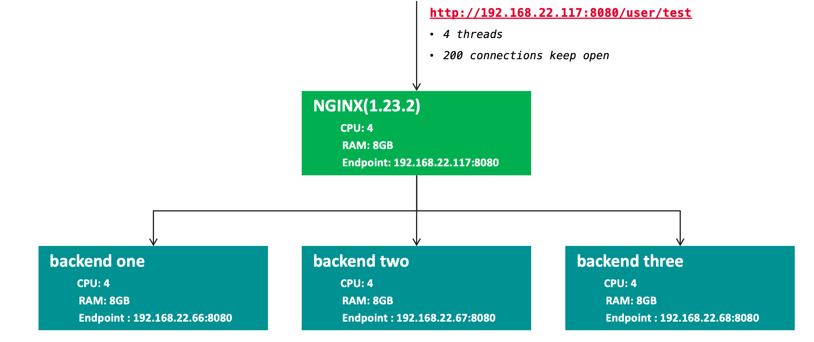

= Protect Application with NGINX(On-premise)
:toc: manual

== 安装与部署

=== 把机准备

[source, bash]
.*功能测试把机*
----
docker run -itd --rm --name app-http -p 8080:8080 cloudadc/cafe:1.0
----

NOTE: Use the `ip addr add 10.1.10.172/24 dev ens33` to add multiple IP addresses to single Linux network interface.

=== 安装

[source, bash]
.*1. Install NGINX*
----
yum localinstall nginx-plus-28-1.el7.ngx.x86_64.rpm
----

[source, bash]
.*2. Install Dependencies(perl-thrift, jq)*
----
yum install epel-release -y
yum install perl-thrift -y
yum install jq -y
----

[source, bash]
.*3. Install NGINX app protect*
----
yum install `ls`
----

The rpm lists as below:

[source, bash]
----
app-protect-28+4.100.1-1.el7.ngx.x86_64.rpm
app-protect-attack-signatures-2023.01.19-1.el7.ngx.x86_64.rpm
app-protect-common-10.208.1-1.el7.ngx.x86_64.rpm
app-protect-compiler-10.208.1-1.el7.ngx.x86_64.rpm
app-protect-engine-10.208.1-1.el7.ngx.x86_64.rpm
app-protect-plugin-4.100.1-1.el7.ngx.x86_64.rpm
app-protect-threat-campaigns-2023.01.24-1.el7.ngx.x86_64.rpm
nginx-plus-module-appprotect-28+4.100.1-1.el7.ngx.x86_64.rpm
----

[source, bash]
.*4. vetify the installed rpms*
----
# rpm -qa | grep app-protect
app-protect-28+4.100.1-1.el7.ngx.x86_64
app-protect-common-10.208.1-1.el7.ngx.el7.centos.x86_64
app-protect-engine-10.208.1-1.el7.ngx.el7.centos.x86_64
app-protect-threat-campaigns-2023.01.24-1.el7.ngx.x86_64
app-protect-attack-signatures-2023.01.19-1.el7.ngx.x86_64
app-protect-compiler-10.208.1-1.el7.ngx.x86_64
app-protect-plugin-4.100.1-1.el7.ngx.x86_64

# rpm -qa | grep nginx
nginx-plus-28-1.el7.ngx.x86_64
nginx-plus-module-appprotect-28+4.100.1-1.el7.ngx.x86_64
----

=== 配置

[source, bash]
.*1. nginx.conf 中添加动态模块*
----
load_module modules/ngx_http_app_protect_module.so;
----

[source, bash]
.*2. 在 http/server/location 上下文开启应用防护*
----
app_protect_enable on;
----

[source, bash]
.*3. 在 http/server/location 上下文开启日志（输出到文件）*
----
app_protect_security_log_enable on;
app_protect_security_log "/etc/app_protect/conf/log_default.json" /var/log/app_protect/security.log;
----

[source, bash]
.*4. 启动*
----
systemctl start nginx
----

=== 测试

[source, bash]
.*1. 在 location 上下文开启应用防护*
----
    location /foo {
        status_zone status_app_foo;
        app_protect_enable on;
        proxy_pass http://backend;
    }

    location /bar {
        status_zone status_app_bar;
        proxy_pass http://backend;
    }
----

[source, bash]
.*2. 访问 foo*
----
$ curl "http://10.1.10.195:8101/foo?a="" 
2023/03/15 10:46:39 could not greet: rpc error: code = 7 desc = Blocked by NGINX App Protect, Your support ID is 3607562325608046964
----

=== Dubbo

[source, bash]
.**
----

----

[source, bash]
.**
----

----

== API Security Authentication

=== JWT Validation

[source, bash]
.*1. Generate JWK*
----
./jwkgen.sh nginxjwtauthenticationbykylin 
----

* link:jwt-validation/api.security.jwk[api.security.jwk]

NOTE: The above command geneted a `api.security.jwk`, more details about JWK refer to https://datatracker.ietf.org/doc/html/rfc7517, JWK usually can be accessed from a Zero-trust gateway, or IDP server. In this section we configured JWK on local file system. the generated `api.security.jwk` will be copy to NGINX Host.

*2. Generate JWT*

image:jwt-validation/api.security.jwt.png[]

NOTE: More details about JWT refer to https://datatracker.ietf.org/doc/html/rfc7519.

* link:jwt-validation/api.security.jwt[api.security.jwt]

To view the jwt payload run the following commands:

[source, bash]
----
CONTENT=$(cat jwt-validation/api.security.jwt);  IFS='.' ; read -r header payload signature <<< "$CONTENT" ; echo $payload | base64 --decode
----

The referrenced payload looks as below:

[source, json]
----
{
  "name": "API Security Authention",
  "sub": "ACME Corp. inc",
  "iss": "ACME Corp",
  "iat": 1678862106,
  "exp": 1708862106,
  "uid": "bbc123456"
}
----

[source, bash]
.*3. NGINX Configuration*
----
server {
  listen 8106;
  status_zone status_jwt_validation;
  location / {
    status_zone status_jwt_validation;
    auth_jwt "API Realm";
    auth_jwt_key_file api.security.jwk;
    proxy_pass http://backend;
  }
}
----

* link:jwt-validation/jwt-validation.conf[jwt-validation.conf]

[source, bash]
.*4. Test*
----
// normal request
$ curl -H "Authorization: Bearer `cat jwt-validation/api.security.jwt`" http://10.1.10.195:8106/foo/test?uid=bbc123456
Server address: 172.17.0.2:8080
Server name: 90b887d7843e
Date: 15/Mar/2023:07:39:00 +0000
URI: /foo/test?uid=bbc123456
Request ID: 1100f4eebf0df7dd0167a668aa73c74d

// risk request
$ curl -H "Authorization: Bearer abcded" http://10.1.10.195:8106/foo/test?uid=bbc123456 -I
HTTP/1.1 401 Unauthorized
Server: nginx/1.23.2
Date: Wed, 15 Mar 2023 07:41:30 GMT
Content-Type: text/html
Content-Length: 179
Connection: keep-alive
WWW-Authenticate: Bearer realm="API Realm",error="invalid_token"
----

=== JWT Dual Factor Authentication

*1. The JWT Token Payload defined a user id as authentication factor*

link:jwt-validation/api.security.jwt[api.security.jwt]

[source, bash]
.*2. NGINX Configuration*
----
js_import main from jwt.js;
js_set $jwt_claim_uid main.jwt_payload_uid;

server {
  listen 8107;
  status_zone status_jwt_dual-factor-authentication;
  location / {
    status_zone status_jwt_dual-factor-authentication_location;

    if ($jwt_claim_uid != $arg_uid) {
        return 401 "uid not align with security token governance uid";
    }

    proxy_pass http://backend;
  }
}
----

* link:jwt-dual-factor-authentication/jwt-dual-factor-authentication.conf[jwt-dual-factor-authentication.conf]
* link:jwt-dual-factor-authentication/jwt.js[jwt.js]
* link:jwt-dual-factor-authentication/api.security.jwt[api.security.jwt]

[source, bash]
.*3. Test*
----
// normal request
$ curl -H "Authorization: Bearer `cat jwt-dual-factor-authentication/api.security.jwt`" http://10.1.10.195:8107/foo/test?uid=bbc123456
Server address: 172.17.0.2:8080
Server name: 90b887d7843e
Date: 15/Mar/2023:08:15:23 +0000
URI: /foo/test?uid=bbc123456
Request ID: 7d35c94bf02956c7785147357b2f5799

// risk request
$ curl -H "Authorization: Bearer `cat jwt-dual-factor-authentication/api.security.jwt`" http://10.1.10.195:8107/foo/test?uid=bbc123 ; echo
uid not align with security token governance uid
----

=== JWT Rate Limiting

[source, bash]
.*1. JWT Token*
----
$ CONTENT=$(cat jwt-rate-limit/premium.jwt);  IFS='.' ; read -r header payload signature <<< "$CONTENT" ; echo $payload | base64 --decode
{
  "name": "API Security Authention",
  "sub": "ACME Corp. inc",
  "iss": "ACME Corp",
  "iat": 1678862106,
  "exp": 1708862106,
  "tier": "premium"
}

$ CONTENT=$(cat jwt-rate-limit/standard.jwt);  IFS='.' ; read -r header payload signature <<< "$CONTENT" ; echo $payload | base64 --decode
{
  "name": "API Security Authention",
  "sub": "ACME Corp. inc",
  "iss": "ACME Corp",
  "iat": 1678862106,
  "exp": 1708862106,
  "tier": "standard"
}
----

* link:jwt-rate-limit/premium.jwt[premium.jwt]
* link:jwt-rate-limit/standard.jwt[standard.jwt]

[source, bash]
.*2. NGINX Configuration*
----
js_import extracter from extracttier.js;
js_set $jwt_claim_tier extracter.jwt_payload_tier;

limit_req_zone $binary_remote_addr zone=standard_zone:10m rate=3r/s;
limit_req_zone $binary_remote_addr zone=premium_zone:10m rate=1000r/s;

server {
  listen 8105;
  status_zone status_jwt-rate-limit;

  location /foo {
    status_zone status_jwt-rate-limit_foo;

    if ($jwt_claim_tier = "standard" ) {
        rewrite ^.*$ /standard;
    }

    if ($jwt_claim_tier = "premium" ) {
        rewrite ^.*$ /premium;
    }

    rewrite ^.*$ /all;
  }

  location = /premium {
    limit_req zone=premium_zone burst=5 nodelay;
    proxy_pass http://backend;
  }

  location = /standard {
    limit_req zone=standard_zone burst=5 nodelay;
    proxy_pass http://backend;
  }

  location = /all {
    proxy_pass http://backend;
  }
}
----

* link:jwt-rate-limit/jwt-rate-limit.conf[jwt-rate-limit.conf]
* link:jwt-rate-limit/extracttier.js[extracttier.js]

[source, bash]
.*3. Test*
----
curl -H "Authorization: Bearer `cat jwt-rate-limit/standard.jwt`" http://10.1.10.195:8105/foo/test?uid=bbc123456

curl -H "Authorization: Bearer `cat jwt-rate-limit/premium.jwt`" http://10.1.10.195:8105/foo/test?uid=bbc123456
----

== Performance Testing

=== Prepare the Topology

[source, bash]
.*Start Backend*
----
docker run -itd --rm --name app-http -p 8080:8080 cloudadc/cafe:1.0
----

[source, bash]
.*Count the CPU Usage and Max Active Connections*
----
for i in {1..1000} ; do CPU=$(top -b -n 1 | head -n 4 | grep Cpu | awk '{print $2}'); NUM=$(netstat -antulop | wc -l); echo $CPU, $NUM ; sleep 10 ; done
----

=== NGINX Configuration

[source, bash]
----
upstream backend {
  zone upstream_backend 64k;
  #server 192.168.23.10:80;
  server 192.168.22.66:8080;
  server 192.168.22.67:8080;
  server 192.168.22.68:8080;
}

#app_protect_enable on;
#app_protect_policy_file "/etc/app_protect/conf/NginxDefaultPolicy.json";

#app_protect_user_defined_signatures "/etc/app_protect/conf/uds-illegal-file-type.json";
#app_protect_user_defined_signatures "/etc/app_protect/conf/uds-three.json";
app_protect_user_defined_signatures "/etc/app_protect/conf/uds-five.json";
#app_protect_user_defined_signatures "/etc/app_protect/conf/uds-seven.json";

server {
  listen 8080;
  status_zone server_backend;

  #app_protect_enable on;
  #app_protect_policy_file "/etc/app_protect/conf/NginxDefaultPolicy.json";

  location / {
    status_zone location_backend;

    app_protect_enable on;
    #app_protect_policy_file "/etc/app_protect/conf/uds-illegal-file-type-policy.json";
    #app_protect_policy_file "/etc/app_protect/conf/uds-three-policy.json";
    app_protect_policy_file "/etc/app_protect/conf/uds-five-policy.json";
    #app_protect_policy_file "/etc/app_protect/conf/uds-seven-policy.json";

    #app_protect_enable on;
    #app_protect_policy_file "/etc/app_protect/conf/NginxDefaultPolicy.json";
    #app_protect_policy_file "/etc/app_protect/conf/NginxStrictPolicy.json";
    #app_protect_policy_file "/etc/app_protect/conf/datagurd-policy.json";
    #app_protect_policy_file "/etc/app_protect/conf/uds-seven-policy.json";

    proxy_pass http://backend;
  }
}
----

* link:perf/uds-three.json[perf/uds-three.json]
* link:perf/uds-three-policy.json[perf/uds-three-policy.json]
* link:perf/uds-five.json[perf/uds-five.json]
* link:perf/uds-five-policy.json[perf/uds-five-policy.json]
* link:perf/uds-seven.json[perf/uds-seven.json]
* link:perf/uds-seven-policy.json[perf/uds-seven-policy.json]

=== Implement Performance Test

[source, bash]
----
for i in {1..4} ; do docker run --rm cloudadc/wrk:0.1 -t 4 -c 200 -d 120s http://192.168.22.117:8080/uesr/test ; sleep 100 ; done
----

